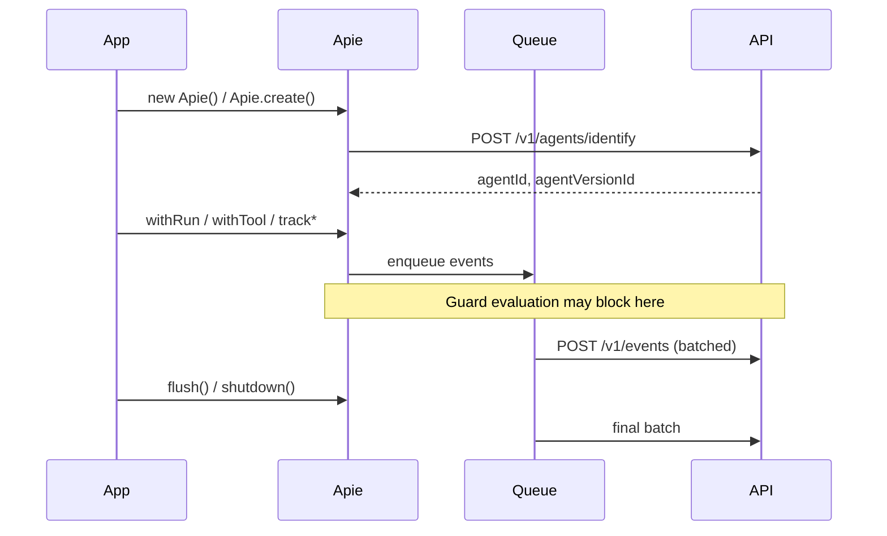

You want to understand what happens between your agent calling `withTool` and events appearing in the dashboard. This mental model helps you debug queue issues, tune flush intervals, and reason about guardrail timing.

## The lifecycle

From your agent's perspective, the SDK follows a simple pattern:

**register → enqueue → batch → flush**



## Registration

When you construct the client with `enabled: true` (the default):

1. An HTTP client is created with your `baseUrl` and `apiKey` (Bearer auth).
2. A background event queue starts flushing on an interval.
3. Agent registration begins immediately (`POST /v1/agents/identify`).
4. If `capabilities` are configured, they are declared after registration succeeds.

Call `ready()` to await registration. Most `track*` and `withTool` methods call this internally.

After registration you can read:

- `apie.agentId` — registered agent ID
- `apie.agentVersionId` — registered version ID

## Event queue

Telemetry is **not** sent synchronously on every tool call. Events are enqueued and flushed:

- **Periodically** every `flushIntervalMs` (default 2000ms)
- **On demand** via `flush()`
- **Before run completion** — completing a run flushes first
- **On shutdown** — `shutdown()` stops the timer and flushes remaining events

Batches are capped at `maxBatchSize` (default 25) per `POST /v1/events`.

<Warning>
  In serverless environments, call `flush()` before your handler returns. Otherwise events may not reach Apie before the process exits.
</Warning>

## Guard evaluation

When guard mode is active, `withTool` and `withGuard` call `POST /v1/guardrails/evaluate` **before** your callback runs:

| Decision | Monitor mode | Guard mode |
| --- | --- | --- |
| `allow` | Proceed | Proceed |
| `warn` | Proceed, log warning | Proceed, log warning |
| `block` | Proceed, log "would block" | Throw — callback never runs |
| `require_approval` | Proceed, log "would require approval" | Wait for dashboard approval |

See [Monitor mode](/guardrails/monitor-mode) and [Enforce guardrails](/guardrails/enforce-guardrails).

## Disabled mode

Set `enabled: false` to get a no-op client with synthetic IDs. Useful for local development without sending telemetry:

<CodeGroup>

```ts TypeScript
const apie = new Apie({ enabled: false, agent: { key: "test", name: "Test" } });
```

```python Python
apie = Apie.create({"enabled": False, "agent": {"key": "test", "name": "Test"}})
```

</CodeGroup>

## What you'll see in the dashboard

- **Agents** — registered identity and version metadata
- **Sessions** — grouped runs with replay timeline
- **Events** — tool calls, actions, guard evaluations, approvals
- **Guardrails** — matched policies and decisions

## Next steps

<CardGroup cols={2}>
  <Card title="Reliable telemetry" icon="database" href="/production/reliable-telemetry">
    Tune queue, persistence, and shutdown.
  </Card>
  <Card title="Diagnose your setup" icon="stethoscope" href="/production/diagnose-your-setup">
    Use doctor and queue diagnostics.
  </Card>
</CardGroup>
