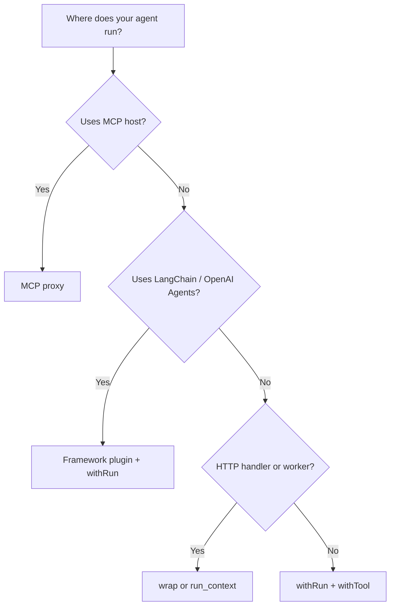

You have Apie connected. Now you need to decide how much instrumentation code to write. The right path depends on where your agent runs and how much control you need over guardrail metadata.

When you finish this page, you'll know which integration tier fits your setup and have a starting code snippet to copy.

## The four tiers

| Tier | When to use | Effort | Guard metadata |
| --- | --- | --- | --- |
| **MCP proxy** | MCP hosts (Cursor, Claude Desktop) | Config only | Inferred from tool names; override in proxy config |
| **Framework plugin** | LangChain, OpenAI Agents, CrewAI | ~5 lines | Inferred inside runs; add explicit metadata for production |
| **Request wrapper** | HTTP handlers, workers, CLI jobs | 1 wrapper | Run context auto-propagates to plugins and MCP clients |
| **Explicit instrumentation** | Custom agents, fine-grained control | ~10 lines per tool | Full `tool`, `action`, `resource` metadata per call |

Start at the lowest tier that fits your runtime. Add metadata as you move toward production Enforce mode.

## Tier 1 — MCP proxy (config only)

If your agent uses MCP tools through Cursor or Claude Desktop, you don't need to change agent code. Point the MCP host at the Apie proxy instead of the upstream server.

```bash
npx apie mcp proxy --config apie.mcp.json
```

See [MCP proxy](/mcp/proxy) for the full setup.

**Best for:** Observing and guarding MCP tool calls without touching your agent.

## Tier 2 — Framework plugin

Pass an Apie callback handler or run hooks to your framework. Tools inside a run are tracked automatically.

<CodeGroup>

```ts LangChain
import { ApieCallbackHandler } from "@apie-sh/sdk/integrations";
import apie from "./apie.config";

const handler = new ApieCallbackHandler(apie, {
  defaultEnvironment: "production",
});

await apie.withRun({ inputSummary: "Process request" }, async () => {
  // Pass handler to your LangChain agent callbacks
});
```

```ts OpenAI Agents
import { createApieRunHooks } from "@apie-sh/sdk/integrations";
import apie from "./apie.config";

const hooks = createApieRunHooks(apie);

await apie.withRun({ inputSummary: "Process request" }, async () => {
  // Pass hooks to your OpenAI Agents run
});
```

```python LangChain
from apie import ApieCallbackHandler
from apie.config import apie

handler = ApieCallbackHandler(apie, default_environment="production")

apie.with_run({"inputSummary": "Process request"}, lambda run: None)
# Pass handler to your LangChain agent callbacks
```

</CodeGroup>

See [Integrations](/integrations/index) for per-framework guides.

**Best for:** LangGraph, OpenAI Agents, CrewAI, and similar frameworks where you control callbacks.

## Tier 3 — Request wrapper

Wrap your HTTP handler or worker entrypoint. Apie creates a run for each request and propagates context to framework plugins and instrumented MCP clients.

<CodeGroup>

```ts TypeScript
import apie from "./apie.config";

export const handleRequest = apie.wrap(
  async (req: Request) => agent.run(await req.json()),
  { inputSummary: (req) => req.url },
);
```

```python Python
from functools import wraps
from apie.config import apie

def with_apie_run(fn):
    @wraps(fn)
    def wrapper(*args, **kwargs):
        with apie.run_context({"inputSummary": "Process request"}):
            return fn(*args, **kwargs)
    return wrapper

@with_apie_run
def handle_request(payload):
  return agent.run(payload)
```

</CodeGroup>

<Note>
  `apie.wrap()` is available in the JavaScript SDK. In Python, use `run_context` or `with_run` to establish run scope.
</Note>

**Best for:** API routes, queue workers, and scheduled jobs where one request equals one run.

## Tier 4 — Explicit instrumentation

Wrap each tool call with `withTool` / `with_tool` and provide metadata. This gives you the most control over guardrails and boundary maps.

<CodeGroup>

```ts TypeScript
await apie.withRun({ inputSummary: "Process request" }, async (run) => {
  await apie.withTool(
    {
      runId: run.id,
      tool: { name: "search", riskLevel: "low" },
      action: { type: "read", name: "search" },
      resource: { type: "knowledge_base" },
    },
    async () => search("query"),
  );
});
```

```python Python
apie.with_run({"inputSummary": "Process request"}, lambda run: apie.with_tool(
    {
        "runId": run.id,
        "tool": {"name": "search", "riskLevel": "low"},
        "action": {"type": "read", "name": "search"},
        "resource": {"type": "knowledge_base"},
    },
    lambda: search("query"),
))
```

</CodeGroup>

Action and resource types are **inferred from tool names** when omitted — fine for Monitor mode. Add explicit metadata before enabling Enforce mode in production. See [Instrument tool calls](/observe/instrument-tool-calls).

**Best for:** Custom agents, production enforcement, and compliance-sensitive workloads.

## Decision flowchart



## Escalate to production

1. Start in **Monitor mode** (default) — guardrails evaluate but never block
2. [Declare capabilities](/boundaries/declare-capabilities) for expected tools
3. [Enable guardrail templates](/guardrails/enable-guardrail-templates) for your environment
4. Switch to **Enforce mode** and add explicit `action`, `resource`, and `riskLevel` metadata

## Next steps

<CardGroup cols={2}>
  <Card title="Trace runs and sessions" icon="timeline" href="/observe/trace-runs-and-sessions">
    Create runs for every agent invocation.
  </Card>
  <Card title="MCP proxy" icon="plug" href="/mcp/proxy">
    Zero-code MCP instrumentation.
  </Card>
</CardGroup>
