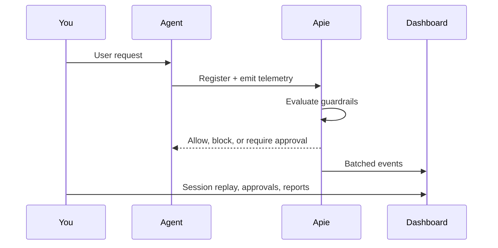

You built an agent that can search, deploy, merge pull requests, and page on-call. Now you need to know what it actually did in production — and stop it before it does something irreversible.

Apie instruments your agents with run tracking, tool-call telemetry, guardrails, and human approval flows. Telemetry batches in the background so your agent loop stays fast.

## What you can do with Apie

<CardGroup cols={2}>
  <Card title="See every tool call" icon="eye" href="/observe/instrument-tool-calls">
    Trace runs and sessions in the dashboard. Replay what your agent did step by step.
  </Card>
  <Card title="Declare boundaries" icon="list-check" href="/boundaries/declare-capabilities">
    Register expected tools and capabilities. Detect when production behavior drifts from what you declared.
  </Card>
  <Card title="Guard risky actions" icon="shield-check" href="/guardrails/monitor-mode">
    Start in Monitor mode to observe. Switch to Enforce mode to block deploys, secret reads, and destructive commands.
  </Card>
  <Card title="Require human approval" icon="user-check" href="/guardrails/human-approval">
    Pause execution when a guardrail requires approval. Resolve in the Apie dashboard.
  </Card>
  <Card title="Instrument MCP without rewriting code" icon="plug" href="/mcp/proxy">
    Point your MCP host at the Apie proxy. Every tool call is observed and optionally guarded.
  </Card>
  <Card title="Ship telemetry reliably" icon="gauge-high" href="/production/reliable-telemetry">
    Batch events, persist the queue to disk, redact secrets, and flush on shutdown.
  </Card>
</CardGroup>

## How it fits together



## Choose your path

| If you... | Start here |
| --- | --- |
| Have never used Apie | [Connect your first agent](/getting-started/connect-your-first-agent) |
| Use MCP in Cursor or Claude Desktop | [MCP proxy](/mcp/proxy) |
| Use LangChain, OpenAI Agents, or similar | [Choose how to instrument](/getting-started/choose-how-to-instrument) |
| Need to block production deploys | [Guardrails](/guardrails/monitor-mode) |
| Run orchestrator + worker agents | [Multi-agent pipelines](/observe/multi-agent-pipelines) |

## SDKs

Apie ships official SDKs for TypeScript and Python. Documentation is organized by what you want to accomplish — code examples show both languages side by side.

| Language | Package | Requirements |
| --- | --- | --- |
| TypeScript | `@apie-sh/sdk` | Node.js 20+, native `fetch` |
| Python | `apie-sdk` | Python 3.10+ |

Install the CLI for onboarding and diagnostics:

<CodeGroup>

```bash TypeScript
npm install @apie-sh/sdk
npm install -D @apie/cli
```

```bash Python
pip install apie-sdk
# MCP proxy optional:
pip install "apie-sdk[mcp-proxy]"
```

</CodeGroup>

## Next steps

<CardGroup cols={2}>
  <Card title="Connect your first agent" icon="rocket" href="/getting-started/connect-your-first-agent">
    Register an agent and send your first test event in minutes.
  </Card>
  <Card title="Choose how to instrument" icon="route" href="/getting-started/choose-how-to-instrument">
    Pick the right integration tier for your runtime.
  </Card>
</CardGroup>
