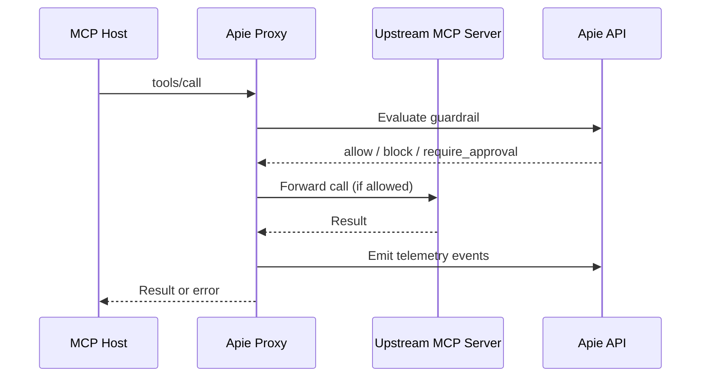

Your agent uses MCP tools through Cursor or Claude Desktop. You want every tool call observed and optionally guarded — without rewriting your agent or adding SDK calls. The Apie MCP proxy sits between your MCP host and the upstream server.

When you finish this page, your MCP host will route tool calls through Apie for telemetry and guardrail evaluation.

## How it works



## Install

<CodeGroup>

```bash TypeScript
npm install -g @apie/cli
# or use npx
```

```bash Python
pip install "apie-sdk[mcp-proxy]"
```

</CodeGroup>

## Configure apie.mcp.json

Create a config file in your project root:

```json apie.mcp.json
{
  "agentKey": "incident-remediation-agent",
  "serverName": "filesystem",
  "releaseMode": "monitor",
  "environment": "development",
  "upstream": {
    "command": "npx",
    "args": ["-y", "@modelcontextprotocol/server-filesystem", "/tmp"]
  },
  "redactKeys": ["token", "password", "secret"]
}
```

| Field | Description |
| --- | --- |
| `agentKey` | Agent key registered with Apie |
| `serverName` | Namespace for tool names (`filesystem.read_file`) |
| `releaseMode` | `monitor` or `guard` |
| `environment` | Environment tag on events |
| `upstream` | Command and args to start the upstream MCP server |
| `redactKeys` | Keys to strip from event payloads |
| `approvalTimeoutMs` | Approval wait timeout in guard mode |

### Multi-server config

Route multiple upstream servers through one proxy:

```json
{
  "agentKey": "my-agent",
  "releaseMode": "monitor",
  "servers": {
    "filesystem": {
      "upstream": { "command": "npx", "args": ["-y", "@modelcontextprotocol/server-filesystem", "/tmp"] }
    },
    "github": {
      "upstream": { "command": "npx", "args": ["-y", "@modelcontextprotocol/server-github"] }
    }
  }
}
```

Select a server at runtime: `--server filesystem`

## Point your MCP host at the proxy

Replace the upstream command in your MCP host config with the Apie proxy:

<CodeGroup>

```json Cursor / Claude Desktop
{
  "mcpServers": {
    "filesystem": {
      "command": "npx",
      "args": ["@apie/cli", "mcp", "proxy", "--config", "/path/to/apie.mcp.json"]
    }
  }
}
```

```bash Shell script
#!/bin/bash
apie mcp proxy --config apie.mcp.json
```

</CodeGroup>

## Run the proxy

<CodeGroup>

```bash TypeScript
npx apie mcp proxy --config apie.mcp.json
# SSE transport for HTTP clients:
npx apie mcp proxy --config apie.mcp.json --transport sse --port 3100
# Guard mode override:
npx apie mcp proxy --config apie.mcp.json --release-mode guard
```

```bash Python
apie mcp proxy --config apie.mcp.json
apie mcp proxy --config apie.mcp.json --transport sse --port 3100
apie mcp proxy --config apie.mcp.json --release-mode guard
```

</CodeGroup>

## Validate

<CodeGroup>

```bash TypeScript
npx apie doctor --mcp --mcp-config apie.mcp.json
```

```bash Python
apie doctor --mcp --mcp-config apie.mcp.json
```

</CodeGroup>

### What you'll see

MCP tool calls in the dashboard with inferred action and resource metadata. In guard mode, blocked calls return error `-32001` and approval-denied calls return `-32002`.

## Auto tool registration

When the proxy receives `tools/list` from upstream, it automatically defines each tool with Apie. This populates your boundary map without manual declaration.

## Next steps

<CardGroup cols={2}>
  <Card title="MCP enforcement recipe" icon="shield" href="/recipes/mcp-enforcement">
    Guard mode + approval routing.
  </Card>
  <Card title="Instrumented MCP client" icon="code" href="/mcp/instrumented-client">
    In-process MCP for custom agents.
  </Card>
</CardGroup>
