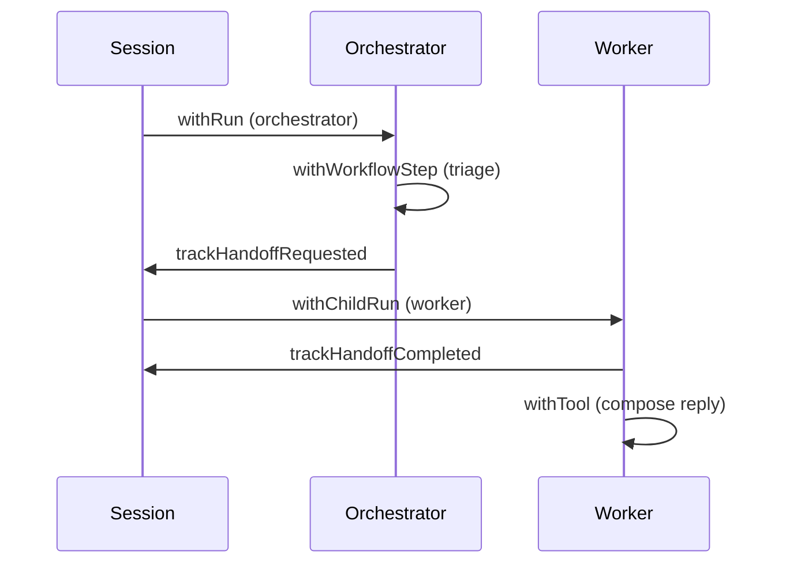

You run an orchestrator that triages tickets and delegates response drafting to a worker agent. You want the full story — who did what, when the handoff happened, and what each agent produced — in one session replay.

When you finish this page, you'll model orchestrator → worker pipelines with sessions, child runs, workflow steps, and handoff events.

## The pattern



## Complete example

<CodeGroup>

```ts TypeScript
import { Apie } from "@apie-sh/sdk";

const apie = await Apie.create({
  agent: { key: "support-ops-orchestrator", name: "Support Ops Orchestrator" },
  releaseMode: "monitor",
});

await apie.withSession(
  {
    kind: "pipeline",
    inputSummary: "Handle urgent enterprise support escalation",
    metadata: { triggerKind: "support_escalation" },
  },
  async (session) => {
    await apie.withRun(
      {
        sessionId: session.id,
        stepKey: "orchestrator",
        stepName: "Orchestrator",
        stepIndex: 0,
      },
      async (orchestratorRun) => {
        await apie.withWorkflowStep(
          {
            runId: orchestratorRun.id,
            sessionId: session.id,
            stepKey: "triage-ticket",
            stepName: "Triage ticket",
            stepIndex: 1,
          },
          async () => { /* triage logic */ },
        );

        await apie.trackHandoffRequested({
          sessionId: session.id,
          sourceRunId: orchestratorRun.id,
          reason: "Delegate customer response draft",
          payloadSummary: { ticketId: "SUP-123", priority: "urgent" },
        });

        await apie.withChildRun(
          {
            sessionId: session.id,
            parentRunId: orchestratorRun.id,
            stepKey: "response-worker",
            stepName: "Response worker",
            stepIndex: 2,
            role: "worker",
          },
          async (workerRun) => {
            await apie.trackHandoffCompleted({
              sessionId: session.id,
              runId: workerRun.id,
            });

            await apie.withTool(
              {
                runId: workerRun.id,
                tool: { name: "support.compose_reply", riskLevel: "low" },
                action: { type: "write", name: "support.compose_reply" },
                resource: { type: "work_item", externalId: "SUP-123" },
              },
              async () => { /* compose draft */ },
            );
          },
        );
      },
    );
  },
);

await apie.flush();
await apie.shutdown();
```

```python Python
from apie import Apie

apie = Apie.create({
    "agent": {"key": "support-ops-orchestrator", "name": "Support Ops Orchestrator"},
    "release_mode": "monitor",
})

def orchestrator_work(session, orchestrator_run):
    apie.with_workflow_step(
        {
            "runId": orchestrator_run.id,
            "sessionId": session.id,
            "stepKey": "triage-ticket",
            "stepName": "Triage ticket",
            "stepIndex": 1,
        },
        lambda: None,
    )

    apie.track_handoff_requested({
        "sessionId": session.id,
        "sourceRunId": orchestrator_run.id,
        "reason": "Delegate customer response draft",
        "payloadSummary": {"ticketId": "SUP-123", "priority": "urgent"},
    })

    def worker_work(worker_run):
        apie.track_handoff_completed({
            "sessionId": session.id,
            "runId": worker_run.id,
        })
        apie.with_tool(
            {
                "runId": worker_run.id,
                "tool": {"name": "support.compose_reply", "riskLevel": "low"},
                "action": {"type": "write", "name": "support.compose_reply"},
                "resource": {"type": "work_item", "externalId": "SUP-123"},
            },
            lambda: None,
        )

    apie.with_child_run(
        {
            "sessionId": session.id,
            "parentRunId": orchestrator_run.id,
            "stepKey": "response-worker",
            "stepName": "Response worker",
            "stepIndex": 2,
            "role": "worker",
        },
        worker_work,
    )

apie.with_session(
    {
        "kind": "pipeline",
        "inputSummary": "Handle urgent enterprise support escalation",
    },
    lambda session: apie.with_run(
        {"sessionId": session.id, "stepKey": "orchestrator", "stepIndex": 0},
        lambda run: orchestrator_work(session, run),
    ),
)

apie.flush()
apie.shutdown()
```

</CodeGroup>

### What you'll see

A session replay showing:

1. Orchestrator run with triage workflow step
2. Handoff requested event with ticket metadata
3. Child worker run with handoff completed
4. Tool call for composing the reply

## Step metadata

Use `stepKey`, `stepName`, and `stepIndex` on runs and workflow steps to keep the timeline ordered and readable:

| Field | Purpose |
| --- | --- |
| `stepKey` | Stable identifier (`orchestrator`, `response-worker`) |
| `stepName` | Human-readable label |
| `stepIndex` | Sort order in session replay |
| `role` | `orchestrator`, `worker`, or custom |

## Recipe walkthrough

See [Multi-agent handoff recipe](/recipes/multi-agent-handoff) for a line-by-line walkthrough of the full example script.

## Next steps

<CardGroup cols={2}>
  <Card title="Declare capabilities" icon="list-check" href="/boundaries/declare-capabilities">
    Declare what each agent in the pipeline may do.
  </Card>
  <Card title="Production release gate" icon="shield" href="/recipes/production-release-gate">
    Pipeline with risky CI/CD actions.
  </Card>
</CardGroup>
